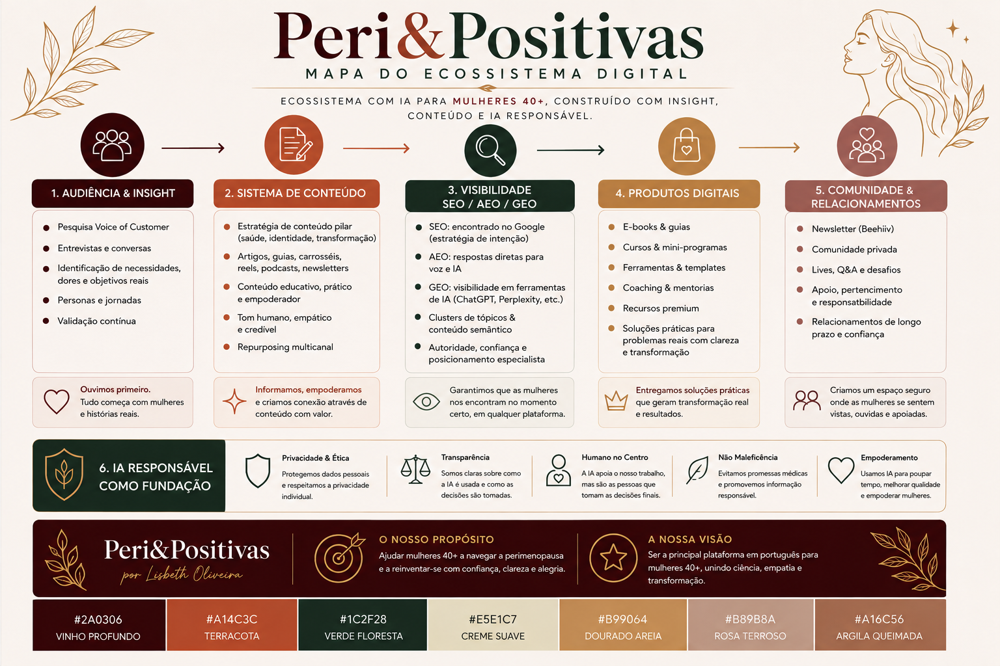
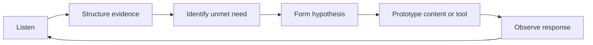

# Peri&Positivas — AI-Enabled Digital Product & Content Ecosystem

> A portfolio case study on building a digital brand and product ecosystem for women 40+, combining audience research, content strategy, product discovery, multi-channel delivery and responsible use of AI.

**Project:** Peri&Positivas  
**Role:** Founder / Product & Content Strategy  
**Status:** In development  
**Focus:** Women 40+ · Midlife transitions · Wellbeing · Career reinvention · AI-enabled content and product systems

> **Portfolio note:** This repository presents selected strategy, product and AI-workflow thinking behind the project. It intentionally excludes private commercial information, sensitive user data and internal business material.

## Ecosystem map

*Visual summary of the Peri&Positivas ecosystem: audience insight, content, SEO/AEO/GEO visibility, digital products, community and responsible AI as a foundation.*

## Project overview

Peri&Positivas is an independent digital initiative designed around a recurring problem: women in midlife often face overlapping changes in health, identity, work, confidence and life direction, while the information available to them is frequently fragmented, generic or overly prescriptive.

The product challenge is therefore not simply to publish more content. It is to build a useful ecosystem that can help a user move from:

**uncertainty → understanding → decision → action**

The project is being developed as a **multi-channel digital ecosystem**, connecting audience research, editorial content, owned-audience relationships, interactive tools and responsible AI-assisted workflows.

## Technology & delivery stack

Peri&Positivas is designed to be delivered through a practical combination of established publishing platforms, rapid-prototyping tools and AI-enabled workflows.

| Layer | Platform / approach | Role in the ecosystem |
|---|---|---|
| **Website & content hub** | **WordPress** | Main web presence, long-form content, SEO/AEO/GEO publishing and evergreen resource hub |
| **Newsletter & owned audience** | **Beehiiv** | Subscriber relationship, recurring editorial formats, audience capture and direct distribution |
| **Interactive tools & prototypes** | **Lovable** | Rapid prototyping of digital tools, guided experiences and product concepts before deeper implementation |
| **AI-assisted operating layer** | **AI workflows** | Voice-of-Customer synthesis, research structuring, editorial planning, hypothesis generation, repurposing, workflow automation and quality-control support |
| **Portfolio & technical documentation** | **GitHub** | Public documentation of selected product logic, responsible-AI principles and future technical prototypes |

The objective is not to use technology for its own sake. Each layer has a defined job in the user journey: **discovery, relationship, decision support, delivery or learning**.

## Current build roadmap

The delivery roadmap connects product strategy with an increasingly operational ecosystem:

1. **Audience and product foundation** — define user needs, journey stages, content pillars and product hypotheses.
2. **WordPress content hub** — build the main searchable website and structured SEO/AEO/GEO content base.
3. **Beehiiv audience layer** — connect newsletter, subscriber capture and recurring relationship-building formats.
4. **Lovable product prototypes** — test interactive tools, decision-support experiences and lightweight digital products.
5. **AI-assisted workflows** — improve research, content operations, repurposing, automation and quality control while preserving human review.
6. **Feedback and iteration** — use qualitative feedback and user behaviour to refine content, tools and future product decisions.

This roadmap allows the project to move from **strategy → publishing → audience relationship → interactive product → continuous learning** without requiring every component to be built at once.

## Product strategy

The ecosystem is being designed across four connected layers:

### 1. Audience research

Research is used to identify:

- functional and emotional pain points,
- explicit and implicit questions,
- barriers to action,
- search intent and decision stages,
- language used by the audience,
- hypotheses that still need validation.

The methodology deliberately separates **observed evidence, patterns, strategic inference and hypotheses** to avoid presenting small qualitative samples as market truth.

### 2. Content & discovery

Content is treated as part of the product experience rather than only as a marketing channel.

The editorial system explores:

- SEO, AEO and GEO-oriented content architecture,
- search-intent mapping,
- educational articles and decision-support content,
- newsletters and recurring editorial formats,
- evidence-aware health communication,
- content pathways connected to user needs and journey stages.

### 3. Tools & digital products

Potential product formats include:

- guided self-assessment tools,
- decision frameworks,
- practical guides and workbooks,
- structured learning experiences,
- career-reinvention resources,
- AI-assisted information and navigation tools.

The emphasis is on reducing uncertainty and helping users make better-informed next-step decisions rather than promising universal solutions.

### 4. Guided support & community

The longer-term product vision explores ways to connect information with human support, structured programmes and community experiences.

## AI as an enabling layer

AI is used as a support system across research, content and product workflows — not as a substitute for judgment or evidence.

Potential applications include:

- clustering Voice-of-Customer themes,
- mapping user questions and intent,
- generating structured research hypotheses,
- supporting editorial planning,
- repurposing content across formats,
- prototyping decision-support experiences,
- workflow automation and quality-control checks.

## Responsible AI principles

Because the project touches wellbeing and health-adjacent topics, the AI layer is designed around explicit boundaries:

1. **No automatic diagnosis** — symptoms or experiences are not treated as proof of a medical condition.
2. **Evidence vs inference** — sourced facts, strategic interpretation and hypotheses are kept distinct.
3. **Source quality** — health-related claims should rely on credible, current sources.
4. **Uncertainty is visible** — the system should say when evidence is incomplete or a conclusion cannot be supported.
5. **Human review** — AI-generated health or high-stakes content requires human editorial judgment.
6. **Privacy by design** — sensitive personal data should not be exposed through public portfolio artefacts.

More detail is available in [`docs/responsible-ai.md`](docs/responsible-ai.md).

## Example research framework

A qualitative audience comment can be analysed through four levels:

| Layer | Question |
|---|---|
| **Observed evidence** | What did the person actually say or describe? |
| **Pattern** | What repeats within the available sample? |
| **Strategic inference** | What might this mean for content or product design? |
| **Hypothesis** | What needs further validation before being treated as true? |

This framework helps avoid overclaiming from limited qualitative data while still turning research into actionable product questions.

## Product discovery loop

The project is therefore approached as an iterative product-discovery system rather than a fixed content calendar.

## What this project demonstrates

- Digital product strategy
- Multi-channel product ecosystem design
- Audience and Voice-of-Customer research
- Qualitative research synthesis
- Product discovery and hypothesis design
- Customer-journey thinking
- SEO / AEO / GEO content strategy
- WordPress-based content delivery planning
- Beehiiv newsletter and owned-audience strategy
- Low-code / rapid product prototyping with Lovable
- Responsible AI application
- Evidence-aware content design
- AI-assisted workflow design
- Brand and content-system architecture
- Translation of user insight into product opportunities

## Documentation

- [`docs/product-strategy.md`](docs/product-strategy.md) — product logic, ecosystem design and delivery model
- [`docs/audience-research.md`](docs/audience-research.md) — qualitative research framework
- [`docs/content-system.md`](docs/content-system.md) — content as a product and discovery layer
- [`docs/responsible-ai.md`](docs/responsible-ai.md) — boundaries and AI principles

---

### About this portfolio project

This repository documents selected strategic, product and AI-enabled work behind Peri&Positivas. It is designed to demonstrate how audience insight can be translated into a real multi-channel digital ecosystem while keeping confidential business material outside the public repository.
